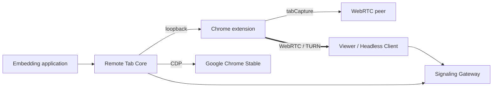

# BrowShare Remote Tab

BrowShare Remote Tab is an open-source engine for streaming and controlling one remote Google Chrome tab from a web application through `tabCapture`, WebRTC, and Chrome DevTools Protocol.

Source repository: [x3zvawq/browshare-remote-tab](https://github.com/x3zvawq/browshare-remote-tab).
The current version is an unpublished candidate. Source commits do not constitute a versioned release;
hosted verification results belong to the exact commit recorded by CI.

> [!IMPORTANT]
> Phase 1 contracts and the complete single-tab Standalone path are implemented. Real Google Chrome
> Stable runs have verified a four-tab concurrent slice, Viewer takeover and reconnect, coordinated
> Extension/Core diagnostics, delayed Viewer pairing within the Ticket lifetime, and forced
> TURN/UDP, TURN/TCP and TURN/TLS paths. Bounded ICE restart and Embedder-authorized fresh-Ticket
> reconnect plus acknowledged quality presets are implemented. Real runs have also verified all
> three sender presets, decoded Viewer resolution, recovery from a temporary UDP outage through ICE
> restart, five-second inbound/outbound WebRTC metrics with teardown cleanup, real fresh-Ticket
> automatic reconnect, repeated replacement/cleanup soak and the current Extension/Standalone
> restart boundaries. Phase 4 now carries remote file-chooser uploads through the dedicated
> DataChannel, turns ordinary remote `window.open()` calls into Embedder-authorized Viewer-local
> confirmations, delivers Session-attributed downloads and structured Notices, and transfers text
> and PNG clipboard content only after explicit user actions. These paths include default Viewer UI,
> browser-permission fallbacks and real Chrome evidence. Embedder-provided Page Script source now
> runs in the top-level page MAIN world before six fixed `browshare:*` lifecycle events, with typed
> delivery to Headless Client and Viewer and failure isolation verified in real Chrome. Core now
> also fails and removes tracked Sessions immediately when their main target, CDP attachment, or
> browser connection disappears. Standalone-crash orphan reconciliation and Linux Compose
> deployment are implemented, and a fresh third-party-style source deployment has passed the
> README-only build, bootstrap, compatibility, real Session and cleanup path. All workspace and
> runtime package versions are coordinated at the unreleased `0.1.23`; reproducible npm, GHCR, CRX, checksum, SBOM
> and source-release workflows are present, but no public registry or GitHub release has completed
> yet. The baseline Chrome
> `152.0.7977.75` + Extension `0.1.14` compatibility set has passed
> the consolidated four-Session Gate over both direct ICE and forced TURN/TLS, and the first public
> protocol/embedding API baseline is frozen. Version `0.1.15` additionally verifies first-install managed
> configuration recovery and simultaneous fresh Chrome startup/capture in BrowShare Worker. The Viewer desktop matrix passes current branded
> Chrome, Edge, Safari and Firefox builds. Mobile remains a preview tier with responsive controls,
> tap/drag, two-finger scrolling and an explicit soft-keyboard action; physical-device parity is not
> claimed. The project has not published an npm package or
> production image yet.

The current 0.1.23 / protocol 1.4 candidate includes owned-window selection, revision-bound input,
child-close recovery and immutable per-Session media limits. Focused real Chrome verification covers
131-window catalogs, window-bound actions, lifecycle races and media limits; BrowShare integration
verifies maintenance child-window login, persisted Profile state and Profile media policy snapshots.
Negotiated automatic/custom encoder quality has passed focused real Chrome acceptance, including
decoded resolution/FPS, network-pressure recovery and encoder-pressure adaptation, as recorded in
[Testing](docs/design/08-testing.md#advanced-quality-development-evidence-2026-09-06-unpublished-0123--protocol-14).
The refreshed full release matrix and external publication remain pending. See
[the embedding contract](docs/design/03-embedding-api.md).

Report security issues through the [private security reporting policy](docs/SECURITY.md).


## Deploy one complete host

This quick start takes a fresh source checkout to one working Linux `amd64` host with a Signaling
Gateway, an operator-built Google Chrome Stable node, a self-signed Extension and the Standalone
Embedder API. It verifies a real `READY` Session before declaring the deployment usable.

> [!WARNING]
> The quick start uses plain `ws:` for an initial controlled test. Put the public Gateway behind a
> trusted TLS terminator and use `wss:` before exposing it to real users. CDP, Extension loopback,
> metrics, the Extension update server and the Standalone API must remain on loopback.

### Check the host

Run these commands from the repository root on a Linux `amd64` Docker Engine host. Docker Desktop
does not provide the host-network contract used by this deployment.

```bash
test "$(uname -s)" = Linux
test "$(uname -m)" = x86_64
docker version
docker compose version
node --version
openssl version
curl --version
```

The source build requires Node.js `24.11.0` or newer, Corepack and the pnpm version declared in
`package.json`. The Docker daemon needs outbound HTTPS access to npm registries, the pinned Node
base image, Google Chrome's Debian package and the nginx image.

Choose the browser-reachable host or DNS name and keep the default ports unless they are already in
use. The project name keeps this deployment's containers and volumes separate from other Compose
projects.

```bash
read -r -p 'Public host or DNS name for the Signaling Gateway: ' REMOTE_TAB_PUBLIC_HOST
test -n "$REMOTE_TAB_PUBLIC_HOST"

export REMOTE_TAB_COMPOSE_PROJECT='browshare-remote-tab'
export REMOTE_TAB_GATEWAY_PORT='8081'
export REMOTE_TAB_GATEWAY_METRICS_PORT='9090'
export REMOTE_TAB_EXTENSION_UPDATE_PORT='8090'
export REMOTE_TAB_CDP_PORT='9222'
export REMOTE_TAB_EXTENSION_PORT='9224'
export REMOTE_TAB_API_PORT='9230'
```

Only `${REMOTE_TAB_GATEWAY_PORT}` is intended for public ingress. If the host firewall or an
upstream proxy cannot expose that port, fix the ingress before testing a Viewer; never publish the
five loopback ports as a workaround.

### Build and sign the Extension

Generate the private key outside the served release directory. Preserve this key securely for
upgrades: a different key produces a different Extension ID.

```bash
corepack enable
pnpm install --frozen-lockfile
pnpm --filter @browshare/remote-tab-extension build
pnpm --filter @browshare/remote-tab-extension-signing build

mkdir -p tmp/extension-signing deploy/compose/extension-release
node tools/extension-signing/dist/cli.mjs generate-key \
  --key tmp/extension-signing/private.pem

extension_result="$(node tools/extension-signing/dist/cli.mjs build \
  --source packages/extension/build/chrome \
  --key tmp/extension-signing/private.pem \
  --out deploy/compose/extension-release \
  --base-url "http://127.0.0.1:${REMOTE_TAB_EXTENSION_UPDATE_PORT}/")"
extension_id="$(printf '%s' "$extension_result" | node -e \
  "let s='';process.stdin.on('data',c=>s+=c).on('end',()=>process.stdout.write(JSON.parse(s).extensionId))")"
test "${#extension_id}" -eq 32
printf 'Extension ID: %s\n' "$extension_id"
```

The served directory must contain the generated `.crx` and `updates.xml`, but not
`private.pem`. The signing command also writes the SHA-256 digest into its JSON result for release
verification.

### Create the private runtime configuration

The four credentials below are intentionally independent. The file is ignored by Git and must stay
owner-readable only.

```bash
viewer_ticket_secret="$(openssl rand -hex 32)"
core_binding_token="$(openssl rand -hex 32)"
api_token="$(openssl rand -hex 32)"
runtime_secret="$(openssl rand -hex 32)"

umask 077
cat > deploy/compose/runtime.env <<EOF
BROWSHARE_REMOTE_TAB_GATEWAY_ID=gateway-1
BROWSHARE_REMOTE_TAB_GATEWAY_PUBLIC_ENDPOINT=ws://${REMOTE_TAB_PUBLIC_HOST}:${REMOTE_TAB_GATEWAY_PORT}
BROWSHARE_REMOTE_TAB_GATEWAY_HOST=0.0.0.0
BROWSHARE_REMOTE_TAB_GATEWAY_PORT=${REMOTE_TAB_GATEWAY_PORT}
BROWSHARE_REMOTE_TAB_GATEWAY_METRICS_HOST=127.0.0.1
BROWSHARE_REMOTE_TAB_GATEWAY_METRICS_PORT=${REMOTE_TAB_GATEWAY_METRICS_PORT}
BROWSHARE_REMOTE_TAB_VIEWER_TICKET_SECRET=${viewer_ticket_secret}
BROWSHARE_REMOTE_TAB_CORE_BINDING_TOKEN=${core_binding_token}
BROWSHARE_REMOTE_TAB_ICE_SERVERS_JSON=[]
BROWSHARE_REMOTE_TAB_ICE_TRANSPORT_POLICY=all

BROWSHARE_REMOTE_TAB_CDP_ENDPOINT=http://127.0.0.1:${REMOTE_TAB_CDP_PORT}
BROWSHARE_REMOTE_TAB_API_TOKEN=${api_token}
BROWSHARE_REMOTE_TAB_API_HOST=127.0.0.1
BROWSHARE_REMOTE_TAB_API_PORT=${REMOTE_TAB_API_PORT}
BROWSHARE_REMOTE_TAB_EXTENSION_HOST=127.0.0.1
BROWSHARE_REMOTE_TAB_EXTENSION_PORT=${REMOTE_TAB_EXTENSION_PORT}
BROWSHARE_REMOTE_TAB_EXTENSION_ID=${extension_id}
BROWSHARE_REMOTE_TAB_EXTENSION_UPDATE_URL=http://127.0.0.1:${REMOTE_TAB_EXTENSION_UPDATE_PORT}/updates.xml
BROWSHARE_REMOTE_TAB_RUNTIME_SECRET=${runtime_secret}
BROWSHARE_REMOTE_TAB_TEMP_ROOT=/var/lib/browshare/remote-tab
BROWSHARE_REMOTE_TAB_MAX_SESSIONS=16
EOF
chmod 600 deploy/compose/runtime.env
```

An empty ICE server list is suitable only when direct candidates are known to work. A production
deployment normally supplies STUN/TURN configuration through
`BROWSHARE_REMOTE_TAB_ICE_SERVERS_JSON`; see [Signaling, ICE, and TURN](docs/design/06-signaling-and-ice.md).

### Start and verify the stack

Validate interpolation before building. The first Chrome start on a fresh Profile installs the
force-installed CRX, then performs one controlled restart so both Extension roles receive their
managed runtime configuration.

```bash
docker compose -p "$REMOTE_TAB_COMPOSE_PROJECT" \
  -f deploy/compose/compose.all-in-one.yml config --quiet
docker compose -p "$REMOTE_TAB_COMPOSE_PROJECT" \
  -f deploy/compose/compose.all-in-one.yml up -d --build
docker compose -p "$REMOTE_TAB_COMPOSE_PROJECT" \
  -f deploy/compose/compose.all-in-one.yml ps
```

Wait for both health-checked services to become healthy, then verify the exact Chrome, Extension,
Core and protocol compatibility tuple:

```bash
until curl --fail --silent \
  "http://127.0.0.1:${REMOTE_TAB_GATEWAY_METRICS_PORT}/health/live" >/dev/null; do sleep 2; done
until curl --fail --silent \
  "http://127.0.0.1:${REMOTE_TAB_API_PORT}/health/ready" >/dev/null; do sleep 2; done

set -a
. deploy/compose/runtime.env
set +a
node deploy/compose/check-runtime.mjs \
  --base-url "http://127.0.0.1:${REMOTE_TAB_API_PORT}"
```

Finish with a real Session attach and deterministic cleanup. `READY` proves that CDP resolved the
created target and both Extension roles accepted the same runtime identity.

```bash
session_id="readme-deploy-$(date +%s)"
session_result="$(curl --fail-with-body --silent --show-error \
  -H "Authorization: Bearer ${BROWSHARE_REMOTE_TAB_API_TOKEN}" \
  -H 'Content-Type: application/json' \
  --data "{
    \"sessionId\": \"${session_id}\",
    \"tab\": {\"mode\": \"create\", \"initialUrl\": \"https://example.com/\"},
    \"capabilities\": [\"navigation\", \"backForward\", \"reload\"],
    \"signaling\": {
      \"gatewayId\": \"${BROWSHARE_REMOTE_TAB_GATEWAY_ID}\",
      \"coreEndpoint\": \"ws://127.0.0.1:${BROWSHARE_REMOTE_TAB_GATEWAY_PORT}\",
      \"viewerEndpoint\": \"${BROWSHARE_REMOTE_TAB_GATEWAY_PUBLIC_ENDPOINT}\",
      \"bindingToken\": \"${BROWSHARE_REMOTE_TAB_CORE_BINDING_TOKEN}\"
    },
    \"navigationPolicy\": \"allow-all\"
  }" \
  "http://127.0.0.1:${REMOTE_TAB_API_PORT}/v1/sessions")"
printf '%s\n' "$session_result"
printf '%s' "$session_result" | node -e \
  "let s='';process.stdin.on('data',c=>s+=c).on('end',()=>{if(JSON.parse(s).state!=='READY')process.exit(1)})"

curl --fail-with-body --silent --show-error -X DELETE \
  -H "Authorization: Bearer ${BROWSHARE_REMOTE_TAB_API_TOKEN}" \
  "http://127.0.0.1:${REMOTE_TAB_API_PORT}/v1/sessions/${session_id}"

node deploy/compose/check-runtime.mjs \
  --base-url "http://127.0.0.1:${REMOTE_TAB_API_PORT}"
curl --fail --silent \
  -H "Authorization: Bearer ${BROWSHARE_REMOTE_TAB_API_TOKEN}" \
  "http://127.0.0.1:${REMOTE_TAB_API_PORT}/v1/reconciliation/targets" | \
  node -e "let s='';process.stdin.on('data',c=>s+=c).on('end',()=>{const r=JSON.parse(s);if(r.trackedSessionCount!==0||r.attachingSessionCount!==0)process.exit(1);console.log(JSON.stringify(r,null,2))})"
```

The reconciliation result can contain Chrome's untracked startup tab; both Session counters must be
zero. The deployment is now ready to issue a single-use Viewer Ticket and use the embedding example
below.

### Stop or reset the deployment

Normal shutdown preserves the Chrome Profile volume, which contains cookies and site credentials:

```bash
docker compose -p "$REMOTE_TAB_COMPOSE_PROJECT" \
  -f deploy/compose/compose.all-in-one.yml down
```

For a disposable test only, append `--volumes` to destroy the Profile and private runtime volumes.
See [Compose deployment](docs/design/17-compose-deployment.md) for split roles, TLS/TURN, alternate
ports and failure diagnosis.

## What it provides

- A Chrome extension that captures a designated tab and publishes WebRTC media.
- A Core library that binds application session IDs to Chrome `tabId` and CDP `targetId`.
- A headless browser client for embedding protocol, file and clipboard behavior without the default UI.
- A framework-agnostic Viewer Web Component.
- A signaling service that validates tickets and relays SDP/ICE only.
- A standalone daemon and CLI for applications that do not embed Core directly.
- Extension signing, enterprise-policy templates, capability probes, and diagnostics.

## What it does not provide

- User, role, billing, workspace, or profile management.
- Google Chrome installation, startup, `user-data-dir`, or proxy management.
- A remote desktop or arbitrary native application stream.
- Isolation between tabs that use the same Chrome profile.
- A promise that every Chrome release will preserve unattended `tabCapture` behavior.

The embedding application owns Chrome lifecycle and business authorization. Remote Tab owns a single tab's capture, input, file transfer, signaling, and connection state.

## Architecture



## Documentation

- [Implementation progress](PROGRESS.md)
- [Agent guide](AGENTS.md)
- [Viewer design system](docs/DESIGN.md)
- [Scope and use cases](docs/design/01-scope.md)
- [Architecture](docs/design/02-architecture.md)
- [Embedding API](docs/design/03-embedding-api.md)
- [Control protocol](docs/design/04-control-protocol.md)
- [Chrome extension and Core](docs/design/05-extension-and-core.md)
- [Signaling, ICE, and TURN](docs/design/06-signaling-and-ice.md)
- [Deployment and diagnostics](docs/design/07-deployment.md)
- [Testing and compatibility](docs/design/08-testing.md)
- [Implementation plan](docs/design/09-implementation-plan.md)
- [Phase 1 package contracts](docs/design/10-package-contracts.md)
- [Phase 2 vertical-slice status](docs/design/11-phase-2-vertical-slice.md)
- [Standalone daemon and API](docs/design/12-standalone-api.md)
- [Phase 3 lifecycle status](docs/design/13-phase-3-lifecycle.md)
- [Phase 4 browser I/O status](docs/design/14-phase-4-browser-io.md)
- [Gate 0 and first public API freeze](docs/design/15-gate-0-and-api-freeze.md)
- [Operations metrics, alerts and runbook](docs/design/16-operations-runbook.md)
- [Compose deployment](docs/design/17-compose-deployment.md)
- [Coordinated upgrade and rollback](docs/design/18-upgrade-and-rollback.md)
- [CI and release-candidate gates](docs/design/19-ci-and-release-gates.md)
- [Supply-chain artifacts and provenance](docs/design/20-supply-chain-artifacts.md)
- [Release-candidate security review](docs/design/21-release-candidate-security-review.md)
- [First stable release and installation](docs/design/22-first-stable-release.md)
- [First stable release candidate record](docs/design/23-first-stable-release-candidate.md)
- [Third-party notices](THIRD_PARTY_NOTICES.md)

## Embed the Viewer

The Viewer is registered explicitly so importing the package remains safe in server-rendered applications:

```ts
import { defineRemoteTabViewer } from '@browshare/remote-tab-viewer'

defineRemoteTabViewer()
```

```html
<browshare-tab-viewer
  ticket="short-lived-single-use-ticket"
  endpoint="wss://signal.example.com"
  locale="zh-CN"
></browshare-tab-viewer>
```

The Viewer pauses media when its browser window loses focus by default. Set
`suspend-when-unfocused="false"` only when background streaming is an explicit product choice.

On a coarse-pointer device the Viewer switches to its mobile preview layout. Actions become at least
44 × 44 CSS pixels, narrow controls remain horizontally reachable, a short in-Viewer notice explains
the support boundary, and an explicit keyboard button focuses the text proxy after the user selects
a remote field. Single-finger tap/drag and two-finger scrolling are supported; hover, right-click,
desktop shortcut parity and browser-restricted clipboard/download behavior are not promised.

When a remote page opens a file chooser and the Session grants `upload`, the Viewer presents its own
local file dialog and progress UI. Applications using the Headless Client receive `upload-request`,
`upload-progress`, and `upload-cancelled` events and call `uploadFiles()` or `cancelUpload()`.

When `clipboardText` or `clipboardImage` is granted, the Viewer provides explicit “Paste to remote”
and “Copy from remote” actions. It never synchronizes automatically. Browser permission denial
falls back to manual text UI and shows an explicit limitation for images; Embedders can cancel the
public request/completion events to provide their own interaction.

An Embedder can attach one already-authorized Page Script source and JSON context when it creates a
Session. Remote Tab runs the source before its fixed lifecycle events in the top-level page MAIN
world and publishes subsequent lifecycle activity as `page-script-event`. Script syntax or runtime
errors are diagnostics only and do not terminate the Session. Script storage, versions, rollout and
applicability remain application responsibilities.

In the default child-target policy, a remote page's new-window request is authorized by the
Embedder and shown as “Open on this device?” by the Viewer. Approval opens only the local Viewer
browser. Maintenance sessions can opt into `retain`, which preserves native remote child windows
instead.

## Related project

BrowShare is the full self-hosted browser-workspace platform and embeds Remote Tab in its Worker. The repositories can be developed and released independently.

## License

[MIT](LICENSE). Google Chrome Stable is an operator-supplied proprietary runtime and is not covered
by that license. Public project images do not contain Chrome; use the source `chrome-node` target to
download and verify the pinned package during your own build. The Linux Compose examples run it as
a nonroot user with Chrome's sandbox enabled and the repository's dedicated deny-by-default seccomp
profile; they do not require `SYS_ADMIN` or privileged containers. See [third-party
notices](THIRD_PARTY_NOTICES.md).
