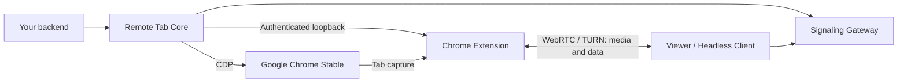

<p align="center">English | <a href="README_cn.md">简体中文</a></p>

<p align="center">
  
</p>

<h1 align="center">BrowShare Remote Tab</h1>

<p align="center">Bring a real Chrome tab into your web application.</p>

<p align="center">
  <a href="https://github.com/x3zvawq/browshare-remote-tab/actions/workflows/ci.yml"></a>
  <a href="LICENSE"></a>
  <a href="https://www.typescriptlang.org/"></a>
  <a href="docs/design/06-signaling-and-ice.md"></a>
</p>

<p align="center">
  <a href="docs/getting-started.md">Get started</a> ·
  <a href="docs/README.md">Documentation</a> ·
  <a href="docs/design/03-embedding-api.md">Embedding API</a> ·
  <a href="https://github.com/x3zvawq/browshare-remote-tab/issues">Report an issue</a>
</p>

BrowShare Remote Tab streams and controls a remote **Google Chrome Stable tab** through WebRTC.
Embed its ready-to-use Viewer in your application, build your own interface with the Headless Client,
or connect your backend directly to Core. A Chrome Extension captures the tab; Core uses Chrome
DevTools Protocol for input and browser actions.

## Features

- **Real browser sessions.** Stream tab video and audio, send pointer and keyboard input, and enter
  text through IME without replacing the remote page.
- **An embeddable Viewer.** A framework-independent Web Component with navigation, quality controls,
  fullscreen, connection feedback and explicit playback permission handling.
- **Browser workflows included.** File-chooser uploads, Session-attributed downloads, text and PNG
  clipboard actions, authorized new-window handling and structured notices.
- **Connection recovery.** Direct WebRTC or TURN, bounded ICE recovery, single-use Viewer Tickets and
  one active Viewer per Session with generation-bound takeover.
- **Control over quality.** Presets, automatic adaptation and custom encoding limits, bounded by the
  media policy chosen for each Session.
- **Clear integration boundaries.** Typed Core hooks, runtime-validated messages, capability
  negotiation and diagnostics; your application owns users, authorization and persistent Profiles.

Desktop Viewers support Chrome, Edge, Safari and Firefox. Mobile offers responsive controls and touch
input as a preview tier. See [testing and compatibility](docs/design/08-testing.md) for the supported
runtime combinations and platform-specific behavior.

## Quick start

Build from source with Node.js **24.11.0+** and the repository's pinned pnpm version:

```bash
git clone https://github.com/x3zvawq/browshare-remote-tab.git browshare-tab-remote
cd browshare-tab-remote
corepack enable
pnpm install --frozen-lockfile
pnpm build
```

Then choose your integration:

| You want to… | Start with… |
| --- | --- |
| Run Chrome, Signaling and the Standalone API on one Linux host | [Complete-host setup](docs/getting-started.md#deploy-one-complete-host) |
| Add remote browsing to an existing web application | [Viewer integration](docs/getting-started.md#use-the-viewer-in-your-application) |
| Manage Chrome yourself and embed the engine | [Core and Headless Client APIs](docs/design/03-embedding-api.md) |
| Use a complete shared-browser workspace with users and Profiles | [BrowShare](https://github.com/x3zvawq/browshare) |

The guides use source-built packages and images. The complete-host setup includes Extension signing,
private runtime configuration and a real Session check; building the workspace alone does not start
a browser. Its Linux Docker host requirements and production TLS/TURN configuration are documented
alongside the commands.

## Embed the Viewer

After [preparing the Viewer package](docs/getting-started.md#use-the-viewer-in-your-application),
register it explicitly in your browser entry point:

```ts
import { defineRemoteTabViewer } from '@browshare/remote-tab-viewer'

defineRemoteTabViewer()
```

Render it with a single-use Ticket issued by your backend and a browser-reachable signaling endpoint:

```html
<browshare-tab-viewer
  ticket="short-lived-single-use-ticket"
  endpoint="wss://signal.example.com"
  locale="en-US"
></browshare-tab-viewer>
```

The values above are placeholders. Keep authorization and Ticket issuance on your server; the
Viewer never needs CDP access or Extension credentials. Importing the package does not register the
element automatically, so server-rendered applications can choose when to initialize it.

## How it fits together



The Gateway handles authentication and SDP/ICE signaling. Media and files travel through WebRTC,
directly or through TURN. CDP and Extension endpoints stay private.

Remote Tab is the reusable engine behind [BrowShare](https://github.com/x3zvawq/browshare).
BrowShare adds the Portal, users and permissions, persistent Profiles, Worker scheduling, proxy
configuration and business policy. Tabs in one Chrome Profile share its browser data; Remote Tab
does not provide account isolation or stream arbitrary native desktop applications.

## Documentation and community

- [Documentation index](docs/README.md) — setup, public APIs, deployment and operations.
- [Contributing](docs/CONTRIBUTING.md) — development workflow, focused checks and pull requests.
- [Issues](https://github.com/x3zvawq/browshare-remote-tab/issues) — bug reports and feature requests.
  Include your component versions, deployment setup and a minimal reproduction for browser issues.
- [Security policy](docs/SECURITY.md) — report vulnerabilities privately; keep credentials and
  Chrome Profile data out of public issues.
- [Changelog](CHANGELOG.md) — changes across the coordinated packages.

## License

[MIT](LICENSE). Google Chrome Stable is an operator-supplied proprietary runtime and is not covered
by this license. Public project image targets exclude Chrome; the local `chrome-node` source build
downloads and verifies the pinned Chrome package. See [third-party notices](THIRD_PARTY_NOTICES.md).
