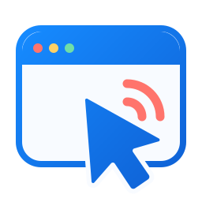
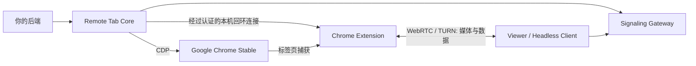

<p align="center"><a href="README.md">English</a> | 简体中文</p>

<p align="center">
  
</p>

<h1 align="center">BrowShare Remote Tab</h1>

<p align="center">将真实的 Chrome 标签页，嵌入你的 Web 应用。</p>

<p align="center">
  <a href="https://github.com/x3zvawq/browshare-remote-tab/actions/workflows/ci.yml"></a>
  <a href="LICENSE"></a>
  <a href="https://www.typescriptlang.org/"></a>
  <a href="docs/design/06-signaling-and-ice.md"></a>
</p>

<p align="center">
  <a href="docs/getting-started.md">快速开始</a> ·
  <a href="docs/README.md">文档</a> ·
  <a href="docs/design/03-embedding-api.md">嵌入 API</a> ·
  <a href="https://github.com/x3zvawq/browshare-remote-tab/issues">反馈问题</a>
</p>

BrowShare Remote Tab 通过 WebRTC 传输和控制远端的 **Google Chrome Stable 标签页**。你可以将开箱即用的 Viewer 嵌入应用，使用 Headless Client 构建自己的界面，或在后端直接集成 Core。Chrome Extension 负责捕获标签页，Core 通过 Chrome DevTools Protocol 执行输入与浏览器操作。

## 项目特色

- **真实浏览器会话**：传输标签页画面和音频，支持鼠标、键盘与输入法文本输入，无需替换远端页面。
- **可嵌入的 Viewer**：与框架无关的 Web Component，包含导航、画质控制、全屏、连接反馈和明确的播放授权处理。
- **完整的浏览器工作流**：文件选择器上传、归属于 Session 的下载、文本与 PNG 剪贴板操作、经授权的新窗口处理和结构化通知。
- **连接恢复**：支持 WebRTC 直连或 TURN、有次数边界的 ICE 恢复、一次性 Viewer Ticket，以及绑定 generation 的接管；每个 Session 同时只允许一个活跃 Viewer。
- **可控的画质**：预设、自动调节与自定义编码限制，均受各 Session 媒体策略约束。
- **清晰的集成边界**：带类型的 Core hooks、消息运行时校验、能力协商与诊断；用户、授权和持久 Profile 由你的应用管理。

桌面 Viewer 支持 Chrome、Edge、Safari 和 Firefox。移动端提供预览级别的响应式控件和触控输入。支持的运行时组合与平台差异见[测试与兼容性](docs/design/08-testing.md)。

## Quick start

使用 Node.js **24.11.0+** 和仓库固定版本的 pnpm 从源码构建：

```bash
git clone https://github.com/x3zvawq/browshare-remote-tab.git browshare-tab-remote
cd browshare-tab-remote
corepack enable
pnpm install --frozen-lockfile
pnpm build
```

接下来选择适合你的集成方式：

| 你的目标 | 从这里开始 |
| --- | --- |
| 在一台 Linux 主机运行 Chrome、信令与 Standalone API | [完整主机部署](docs/getting-started.md#deploy-one-complete-host) |
| 为现有 Web 应用加入远程浏览器能力 | [Viewer 集成](docs/getting-started.md#use-the-viewer-in-your-application) |
| 自己管理 Chrome，并嵌入引擎 | [Core 与 Headless Client API](docs/design/03-embedding-api.md) |
| 使用包含用户和 Profile 管理的完整共享浏览器工作区 | [BrowShare](https://github.com/x3zvawq/browshare) |

指南使用从源码构建的包和镜像。完整主机部署包含 Extension 签名、私有运行配置和真实 Session 验证；仅构建 workspace 不会启动浏览器。Linux Docker 主机要求与生产 TLS / TURN 配置均列在对应命令旁。

## 嵌入 Viewer

[准备好 Viewer 包](docs/getting-started.md#use-the-viewer-in-your-application)后，在浏览器入口显式注册：

```ts
import { defineRemoteTabViewer } from '@browshare/remote-tab-viewer'

defineRemoteTabViewer()
```

使用后端签发的一次性 Ticket，以及浏览器能够访问的信令端点渲染组件：

```html
<browshare-tab-viewer
  ticket="short-lived-single-use-ticket"
  endpoint="wss://signal.example.com"
  locale="en-US"
></browshare-tab-viewer>
```

上述值为占位示例。授权和 Ticket 签发应在服务端完成；Viewer 不需要访问 CDP，也不需要 Extension 凭据。导入包不会自动注册元素，因此服务端渲染应用可以自行选择初始化时机。

## 工作原理



Gateway 负责认证和 SDP / ICE 信令。媒体与文件通过 WebRTC 直连或 TURN 传输。CDP 和 Extension 端点保持私有。

Remote Tab 是 [BrowShare](https://github.com/x3zvawq/browshare) 背后的可复用引擎。BrowShare 在此之上提供 Portal、用户与权限、持久 Profile、Worker 调度、代理配置和业务策略。同一个 Chrome Profile 中的标签页共享浏览器数据；Remote Tab 不提供账号隔离，也不传输任意原生桌面应用。

## 文档与社区

- [文档导航](docs/README.md)：安装、公共 API、部署与运维。
- [贡献指南](docs/CONTRIBUTING.md)：开发流程、针对性检查和 Pull Request。
- [Issues](https://github.com/x3zvawq/browshare-remote-tab/issues)：反馈问题与功能建议。浏览器问题请附上组件版本、部署方式和最小复现步骤。
- [安全策略](docs/SECURITY.md)：私密报告漏洞，请勿在公开 Issue 中包含凭据或 Chrome Profile 数据。
- [版本说明](CHANGELOG.md)：各配套组件的版本变更。

## 许可证

采用 [MIT License](LICENSE)。Google Chrome Stable 是由部署者提供的专有运行时，不在本许可证范围内。项目的公共镜像目标不包含 Chrome；本地 `chrome-node` 源码构建会下载并验证固定版本的 Chrome 安装包。详见[第三方声明](THIRD_PARTY_NOTICES.md)。
