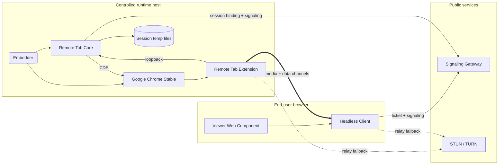
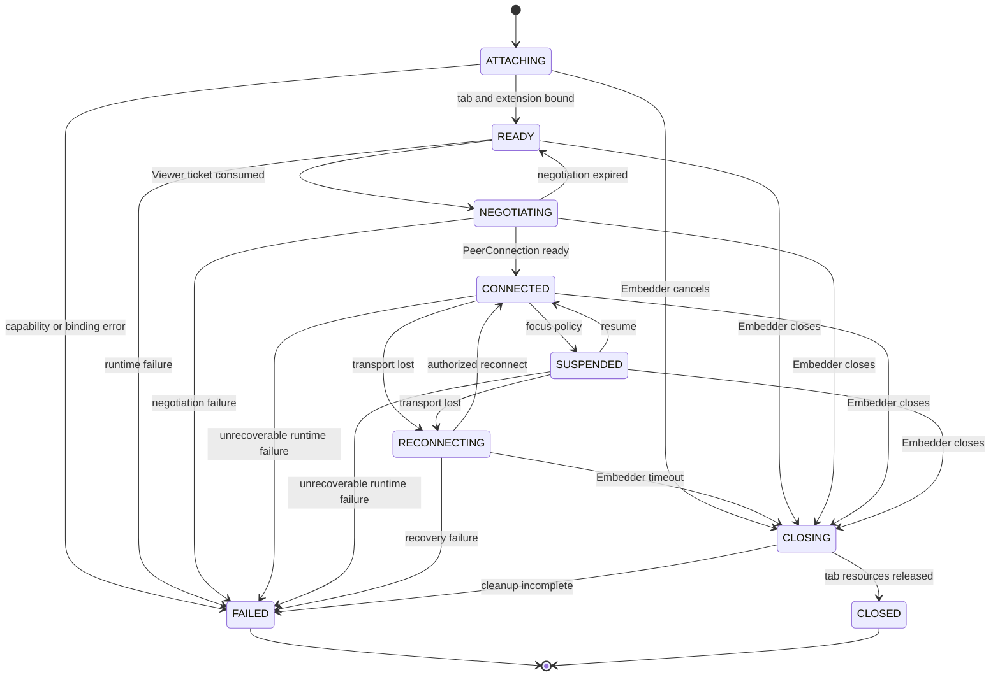

# Architecture

## Components

The Embedder block is outside this repository. It may be BrowShare Worker or a third-party daemon host.

## Ownership

### Core

- Accepts an authorized application Session descriptor.
- Creates or adopts one tab according to the Embedder request.
- Establishes the trusted mapping between application Session, `tabId`, and CDP `targetId`.
- Coordinates extension capture and signaling.
- Dispatches CDP input, navigation, file chooser, download ownership, viewport, and lifecycle operations.
- Rejects messages from stale or replaced Viewers.

Core never installs Chrome, selects an application user, changes a Profile proxy, or persists business authorization.

### Extension

- Captures the assigned tab with `chrome.tabCapture`.
- Owns the browser-side `RTCPeerConnection` and media tracks.
- Exchanges control and file messages with the Viewer over DataChannels.
- Injects approved lifecycle events and receives structured page requests.
- Routes Session-bound file frames and acknowledgements without selecting download ownership.

The extension trusts only its authenticated loopback Core. A page cannot select another tab or create a Viewer session.

### Headless Client

- Consumes a Viewer ticket and connects to the assigned Gateway.
- Negotiates WebRTC and exposes typed state and commands.
- Maps local pointer, keyboard, IME, clipboard, file, quality, and navigation actions into protocol messages.
- Applies capabilities before exposing an action.
- Emits structured events instead of imposing an application UI.

### Viewer

Viewer is a Web Component built on the Headless Client. It implements the default video surface, navigation, controls, files, notices, dialogs, diagnostics, focus pause, accessibility, and localization hooks.

### Signaling Gateway

Gateway validates one side as an authorized Core binding and the other as a short-lived Viewer ticket, then relays SDP and ICE candidates. It may issue short-lived TURN credentials. It does not receive RTP, SCTP file data, page content, or long-term application state.

### Standalone daemon

Standalone wraps Core with configuration, local authentication, diagnostics, and a documented Embedder API. It connects to an existing Chrome/CDP endpoint; it does not own browser installation or automatic startup.

## Session lifecycle

These are Remote Tab connection states, not BrowShare business Session states. The Embedder maps them into its own model.

## Data paths

| Data | Path | Gateway or Backend sees content? |
| --- | --- | --- |
| Video/audio | Extension ↔ Viewer WebRTC tracks | No |
| Pointer/keyboard/navigation | Viewer ↔ Extension DataChannel, then Core/CDP as needed | No |
| Upload/download | Viewer ↔ Extension/Core file DataChannel and host-local temporary storage | No |
| SDP/ICE | Viewer/Core ↔ Gateway | Gateway sees signaling |
| Ticket and capabilities | Embedder → Viewer/Gateway/Core | Only authorization metadata |
| Diagnostics summary | Core/Viewer → Embedder | No page content by default |

## Failure isolation

- Closing one Session stops only its capture, DataChannels, temporary files, and tab.
- Extension service-worker restart rebinds its loopback role while an active offscreen publisher may
  remain connected; loss of the offscreen media runtime fails the affected Session explicitly.
- Main-target close, CDP detachment, or Chrome crash fails and cleans every affected tracked Session;
  Standalone readiness follows the live Chrome probe. Remote Tab does not create a replacement
  browser or resurrect a failed Session.
- Gateway loss does not end an already established PeerConnection unless renegotiation is needed.
- TURN loss affects relay paths; multiple ICE servers can provide redundancy.
- Slow reliable file transfer cannot block realtime pointer input because channels are separate.

## Security boundaries

- CDP and extension loopback services bind only to loopback or an equivalent private IPC boundary.
- Session identifiers from the Viewer are never sufficient to select a Chrome target.
- Capabilities are signed or authorized by the Embedder and enforced again by Core.
- Only the current active Viewer generation may send control messages.
- Page-injected scripts cannot access Core secrets, CDP, arbitrary tabs, or signaling credentials.
- Diagnostics redact URLs, file names, clipboard content, SDP secrets, TURN passwords, and page data by default.
