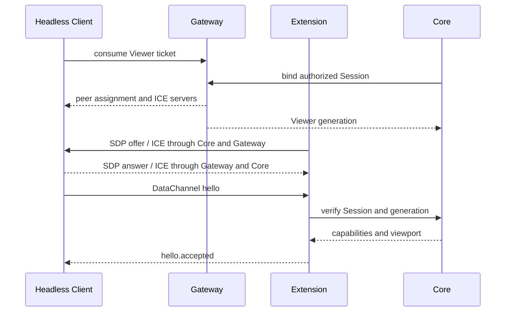

# Control protocol

## Goals

The control protocol carries interactive browser actions and state between the browser-side Client, Extension, and Core. It must keep realtime input responsive while preserving reliable ordering for navigation, text, files, and lifecycle events.

The protocol does not carry application users, billing, Profile definitions, or Chrome process commands.

## Transport channels

```text
WebRTC media tracks
├── video
└── optional tab audio

RTCDataChannel
├── control-reliable
├── control-realtime
└── file-transfer
```

| Channel | Ordering | Reliability | Examples |
| --- | --- | --- | --- |
| `control-reliable` | Ordered | Reliable | Key events, IME, navigation, viewport ACK, Notice result |
| `control-realtime` | Unordered | Limited retransmit or lifetime | Pointer move, wheel, transient telemetry |
| `file-transfer` | Ordered | Reliable with application backpressure | Upload, download and clipboard chunks |

High-frequency pointer messages may be coalesced. Key transitions, mouse press/release, navigation, file completion, and lifecycle events must not be dropped.

## Envelope

Every DataChannel message uses a versioned envelope. The first public release will choose one binary encoding and document it; the logical form is:

```json
{
  "version": 1,
  "minor": 0,
  "type": "input.pointer",
  "sessionId": "application-session-id",
  "viewerGeneration": 3,
  "sequence": 418,
  "payload": {}
}
```

- `version` is the protocol major and `minor` is the backward-compatible feature level.
- `sessionId` is confirmed during handshake; changing it mid-connection closes the peer.
- `viewerGeneration` invalidates input from a replaced Viewer.
- `sequence` orders events where order matters and detects stale duplicates.
- `type` selects a runtime-validated payload schema.
- Unknown messages fail by default. A caller may opt into ignoring a message only on a channel where that message is known to be optional; lifecycle and authorization paths never use that mode.

A decoded control request that is not allowed in the current Session state, lacks a capability or
fails its action returns a stable `error` message to the active generation without failing the Tab
Session. This matters during disconnect races: a late suspend or input message can arrive after Core
has entered `RECONNECTING`. Unexpected internal exceptions and infrastructure lifecycle failures
remain fatal because Core cannot prove that Session state is still coherent. Correlated commands
such as `quality.configure` use their dedicated failure response with the original request ID
instead of leaving callers waiting for a generic error.

## Handshake



Input is disabled until `hello.accepted`. Media may arrive slightly earlier but the Viewer still displays a connecting state.

## Extension loopback binding

The JSON loopback `runtime.bind` message carries the role, Extension identity and version,
Core/Worker `runtimeGeneration`, shared secret, and optional `runtimeInstanceId`. Current Extensions
always send the instance ID generated in `chrome.storage.session`; Core echoes it in
`runtime.ready`. Omission is accepted only for backward-compatible single-runtime operation.

Target discovery fans one `target.resolve` request out to all connected service-worker instances.
Core records `targetId → runtimeInstanceId` only after exactly one success, then records
`sessionId → runtimeInstanceId` during attachment before signaling begins. Both structured loopback
messages and MessagePack binary frames are checked against the Session mapping before dispatch.
An instance cannot acknowledge or inject another instance's Session traffic.

## Input messages

### Pointer

Pointer coordinates are normalized against the acknowledged remote viewport. Client sends content-box coordinates, pointer type, buttons, modifiers, click count and monotonic sequence.

Keyboard messages carry DOM `key`/`code`, modifiers and optional CDP `text`/`unmodifiedText` for
printable key-down events. Browser or assistive-technology text commits use the composition channel
and Core's `Input.insertText` path, so Chinese text and direct text insertion are not reconstructed
from key codes.

During drag, every move includes the currently pressed button. `pointercancel`, connection loss, suspension and takeover synthesize necessary releases to avoid stuck buttons.

### Wheel

Wheel messages carry horizontal and vertical deltas plus delta mode after browser normalization. Client coalesces events within an animation frame but preserves direction changes.

### Keyboard and IME

Physical key transitions carry `code`, `key`, location, modifiers and repeat state. Text composition is a separate reliable sequence:

```text
composition.start
composition.update
composition.commit
composition.cancel
```

The implementation uses CDP text insertion for committed IME text and CDP key events for shortcuts and non-text keys. It must not double-insert characters when a browser produces both key and composition events.

## Navigation

Client requests contain the intended action, not direct CDP commands:

```text
navigation.go
navigation.back
navigation.forward
navigation.reload
navigation.local_open_result
```

Core asks the Embedder to authorize top-level navigation. A denied action returns a stable reason and the confirmed current URL. Client cannot use another message type to bypass the decision.

## Viewport and quality

Client requests desired CSS viewport, device scale intent, frame rate and quality preset. Core applies supported constraints and responds with the actual remote viewport and media settings.

The initial quality presets are:

| Preset | Maximum bitrate | Maximum FPS | Resolution scale |
| --- | ---: | ---: | ---: |
| `data-saver` | 750 kbit/s | 15 | 2× downscale |
| `balanced` | 2.5 Mbit/s | 30 | Native |
| `high` | 6 Mbit/s | 60 | Native |

Viewer sends `quality.request`; Core requires `qualityControl` and resolves the named preset;
Extension applies it through the owning video `RTCRtpSender`. Only a successful
`media.quality_changed` becomes `quality.ack`. Sender absence or `setParameters()` rejection returns a
stable error and leaves the last acknowledged UI value in place.

Pointer mapping changes only after the acknowledged viewport version. A new decoded frame size does not by itself change input coordinates.

Default policy starts at 1280×720, 30 FPS and may adapt up to 1920×1080, 60 FPS. The Embedder can provide lower caps.

A real Google Chrome Stable `152.0.7977.75` run with Extension `0.1.8` verified that the three ACKs
represented sender changes rather than UI state alone. Chrome's WebRTC encoder log recorded 750
kbit/s, 15 FPS and 2× downscale for `data-saver`; 2.5 Mbit/s, 30 FPS and native scale for
`balanced`; and 6 Mbit/s, 60 FPS and native scale for `high`. The Viewer decoded 425×356 in
`data-saver` and 850×712 for the two native-scale presets in that test viewport.

## Suspension and reconnect

Suspension stops media RTP and disables input without closing the PeerConnection or tab. Client sends a reliable suspend/resume request, and Extension acknowledges the applied state.

On transport loss, Headless Client first requests an ICE restart through the existing authenticated
signaling pair. Gateway permits `signal.restart-ice` only from Viewer to Core; Core routes it to the
owning Extension publisher, which creates an ICE-restart offer without replacing the tab or Viewer
generation. Attempts are bounded and time out.

If signaling is unavailable, the Embedder decides whether reconnection remains authorized. Headless
Client calls the configured reconnect provider for a fresh single-use Ticket and endpoint. Gateway's
new assignment must keep the same Session ID and strictly increase the Viewer generation. Stale peers
cannot resume control by replaying an old Ticket or DataChannel.

## Notice and local open

`notice` is a one-way, reliable message containing `level`, stable `code`, and plain-text `message`.
It contains no HTML or executable content. Headless Client emits the structured value, while the
default Viewer renders a dismissible toast with level-specific lifetime and a host-cancelable
`notice` event.

Local open is a separate request/result exchange:

```text
remote new-context request
  → Core normalizes HTTP/HTTPS URL
  → Embedder authorizeNavigation(local-open)
  → navigation.local_open_request with request ID and expiry
  → Viewer confirmation
  → navigation.local_open_result
  → approved URL opens in the Viewer browser only
```

Client opens an approved request with `noopener,noreferrer` after explicit user confirmation. The
result is correlated with the current Viewer generation; stale, expired, or unknown responses are
rejected. A negative Embedder decision is delivered as a structured Notice and never reaches the
confirmation UI.

## File transfer

### Lifecycle

```text
offer → accept with limits → chunks → complete → integrity/size check → delivered
                         ↘ reject/cancel/expire → cleanup
```

The upload exchange uses `file.upload.request`, `file.upload.offer`, `file.upload.accept`,
`file.upload.chunk`, `file.upload.complete`, `file.upload.cancel`, and `file.upload.result`.
Every frame retains the Session ID and Viewer generation in the normal envelope. Chunk `data` is a
MessagePack binary value, never base64 or JSON text.

Core intercepts `Page.fileChooserOpened`, records its `backendNodeId` and single/multiple mode, and
sends one expiring request. Viewer offers descriptors only after explicit local selection. Core
validates file count, per-file size, aggregate size, duplicate IDs, safe names, and storage
reservations before returning the negotiated chunk ceiling. It accepts only contiguous offsets and
calls `DOM.setFileInputFiles` after every reservation commits. A second chooser replaces the first.

The default limits are 32 files, 512 MiB per file, 1 GiB per batch, 64 KiB chunks, and 120 seconds for
request/transfer inactivity. Embedders may lower or raise those positive integer limits per Session.
The protocol decoder always caps an individual encoded chunk frame at 256 KiB.

Viewer applies DataChannel backpressure above 1 MiB and resumes at 256 KiB. Request expiry,
capability revocation, Viewer replacement, disconnect, malformed offsets and Session cleanup abort
uncommitted reservations. Content is never sent through Gateway or Backend.

File content is not logged. Cryptographic content hashes are optional for transfer integrity when a transport or storage adapter requires them; they are not used as a general hostile-environment guard.

## Clipboard transfer

Clipboard transfer supports at most one `text/plain` item and one `image/png` item per operation.
The eleven dedicated message types are:

| Direction | Messages |
| --- | --- |
| Viewer to remote tab | `clipboard.write.offer`, `clipboard.write.accept`, `clipboard.write.chunk`, `clipboard.write.complete`, `clipboard.write.result` |
| Remote tab to Viewer | `clipboard.read.request`, `clipboard.read.offer`, `clipboard.read.accept`, `clipboard.read.chunk`, `clipboard.read.complete`, `clipboard.read.result` |

The descriptor offer contains a unique `itemId`, MIME type and byte size for each item. Binary
chunks use the ordered `file-transfer` DataChannel, preserve MessagePack binary values, and require
contiguous offsets. The default chunk payload is 64 KiB; an encoded chunk frame cannot exceed the
protocol-wide 256 KiB ceiling. Each item is limited to 16 MiB, an operation to 24 MiB, and request
or transfer inactivity to 120 seconds. Viewer replacement, reconnect, DataChannel closure, Session
cleanup, malformed offsets, duplicate IDs or MIME types, and exceeded limits reject the operation
and discard partial buffers.

Clipboard operations are pull-based and never synchronize in the background. The default Viewer
invokes them only from an explicit click. A Headless Client Embedder is responsible for preserving
the same user-action boundary around `writeRemoteClipboard()` and `readRemoteClipboard()`.
Capabilities are independent: `clipboardText` permits `text/plain`, while `clipboardImage` permits
`image/png`.

For a local-to-remote operation, successful assembly and Google Chrome clipboard write are followed
by an owning-tab paste command before `clipboard.write.result` reports success. For a
remote-to-local operation, Core sends descriptors and bytes only after a read request; the Viewer
returns `clipboard.read.result` only after it has validated and assembled every declared item. A
successful acknowledgement that cannot be sent rejects the client promise rather than leaving it
pending.

## Page lifecycle delivery

Core injects one Embedder-provided script and a fixed bootstrap into the top-level page MAIN world.
The bootstrap forwards only these names over `control-reliable` as `page.lifecycle`:

```text
browshare:on_document_start
browshare:on_dom_content_loaded
browshare:on_load
browshare:on_location_changed
browshare:on_session_attached
browshare:on_session_detached
```

The payload contains `name`, `occurredAt`, and an optional current `location`. The normal protocol
envelope supplies the Session ID and Viewer generation. Business context is available only to the
remote page's `CustomEvent.detail`; it is not copied into the Viewer protocol. Location changes cover
top-level document navigation plus `pushState`, `replaceState`, `popstate`, `hashchange`, and BFCache
restoration when the URL changes. `on_session_detached` is sent only during actual Session close,
including while Core is in `CLOSING`; document replacement does not impersonate Session teardown.

Page Script syntax and runtime exceptions become redacted `page-script.error` diagnostics. They do
not produce a protocol `error`, terminate media, or alter navigation and capability authorization.

## Diagnostics

Client and Extension expose redacted WebRTC metrics:

- Negotiated codec.
- Encoded and decoded resolution.
- Send and receive FPS.
- Bitrate, RTT, jitter, packet/frame loss.
- Selected candidate route type.
- Sender quality-limitation reason.
- DataChannel buffered amount and application RTT.

Diagnostics do not include SDP, ICE passwords, full candidate addresses by default, page contents, clipboard values, file data, or full sensitive URLs.

The current implementation samples RTCStats once on connection and approximately every five
seconds while the owning PeerConnection remains connected. Headless Client emits inbound records;
Extension emits outbound records through the validated loopback `media.diagnostic` message, and
Core forwards them to `EmbedderHooks.onDiagnostic`. Both peers also report `bufferedAmount` for
`control-reliable`, `control-realtime` and `file-transfer`. Bitrate and loss ratio are interval
deltas, and `sampleIntervalMs` records the real interval rather than assuming exactly five seconds.

Sampling timers and their in-memory counter history are cleared when a peer is replaced, fails or
closes. A transient `getStats()` failure skips that sample without changing the Session or media
lifecycle. RTCStats IDs are used only as local history keys and never enter an emitted diagnostic.

## Protocol evolution

- Major versions change incompatible semantics.
- Minor versions add optional messages or fields.
- Capabilities gate optional behavior.
- A released `type` string and field meaning cannot be silently repurposed.
- Receivers validate size before decoding and validate schema before acting.
- Fuzz tests cover malformed envelopes, oversized lengths and illegal state transitions.

## Correlated Notice requests (protocol 1.1)

The additive `noticeRequests` capability enables `notice.request`, `notice.response` and
`notice.cancel` on `control-reliable`. The existing one-way `notice` payload remains unchanged.
Core intersects Session, ticket and hello capabilities, and requires a hello envelope minor of
at least 1 for this capability. A 1.0 Viewer continues existing behavior and cannot receive a
request that requires a decision. Media startup with this capability also requires the
coordinated Extension version to match Core, because older Extensions reject the new response.

`notice.request` contains a generated `requestId`, `expiresAt`, and `content`: `kind`
(info/success/warning/error/confirm), plain-text `title` (1–160 characters), `body` (1–2048), and
zero to three buttons with distinct `id` (1–64) and plain-text `label` (1–80). No HTML, Markdown,
URL actions or arbitrary extra fields are accepted. `notice.response` contains the same ID and
one offered `buttonId`, or null for dismissal. An arbitrary button is rejected. Expired or already
cancelled responses cannot revive requests, including responses crossing cancellation in flight.

Core permits four pending requests and ten new requests per Session per rolling minute. Requests
expire after 60 seconds by default; callers may choose 1–120000 milliseconds. An AbortSignal,
expiry, Viewer departure/replacement, capability revocation, Session close or reliable channel
closure resolves pending decisions with null and an explicit cancellation reason. The Extension
reports `media.control_closed` with Session and Viewer generation so a retiring Publisher cannot
cancel requests belonging to its replacement. Confirmation responses bypass the serialized input
command queue, while retaining its Session/generation/state/capability validation.

Headless Client emits `notice-request` and `notice-closed`; `respondToNotice(requestId, buttonId)`
validates the active request before sending. The default Viewer renders requests in a native modal
with textContent, browser focus containment, Escape/dismissal, safe initial focus on Cancel/Close,
focus restoration, a bounded queue and a scrollable narrow layout. Its cancelable `notice-request`
DOM event allows the host to render its own UI and use the same response API. The old one-way
Notice remains a toast. This transport does not itself authorize navigation or install a Page
Script bridge; those callers must explicitly consume the correlated result.


### Observed navigation location (0.1.16 candidate / protocol 1.1)

The optional `navigationState` capability enables `navigation.location_changed { url }`. Core
sends its observed main-frame URL after the accepted handshake and on document/same-document
location changes. URLs use the existing 16384-character transport bound. These updates are
independent of `navigation.result`, which reports a toolbar command's authorization/execution
outcome and may precede a committed destination. A redirected destination is never inferred from
the originally requested URL. Page Script lifecycle bindings do not supply this state.

A denied or cancelled document navigation (including a deferred initial navigation) returns
`navigation.result` with `allowed: false` and the last observed URL. It does not emit a Viewer
connection error: the Session remains usable for a subsequent navigation.

Headless Client emits `navigation-location-change`; Viewer forwards the same event and uses it
for its address bar. While the address field is being edited, updates are retained without
overwriting the user's text; submission ends editing, and blur restores the latest observed URL.
Core sends location updates only if both Session and Viewer negotiated `navigationState`, and
protocol 1.0 peers are not granted this new capability.


### Owned window selection (0.1.18 candidate / protocol 1.2)

`windowSelection` is additive and negotiated only for a retained-window Session with a Viewer
speaking minor version 2 or newer. Without it, the existing single-tab command envelope remains
unchanged. New payloads are:

- `window.state`: `revision`, `selectedTargetId`, `selecting`, `catalogRevision`, `offset`, `total`,
  `windows`, optional `requestId` and structured `error`. Each catalog entry has `targetId`, `title`,
  `url`, and `main`. A catalog snapshot contains every owned window, split into ordered MessagePack
  frames of at most 16 KiB and 128 entries. `offset` is the number of preceding entries and `total`
  is the complete count. `catalogRevision` increases for each snapshot independently of selection
  `revision`. All chunks repeat the same selection and request metadata. Title and URL are display
  excerpts limited to 256 and 512 Unicode code points; IDs remain complete.
- `session.capabilities`: `capabilities`, the remaining negotiated capabilities after a live Embedder
  update. Core sends this only to protocol 1.2 or newer Viewers; restoring a grant requires a new
  Viewer negotiation.
- `window.select`: `requestId`, `targetId`.
- `window.close`: `requestId`; closes the current child after returning to the main window.

The optional envelope field `windowRevision` is required by Core for the negotiated target-dependent
message families: `input.*`, `navigation.request`, `viewport.request`, `file.upload.*`, `clipboard.*`,
`window.select`, and `window.close`. It applies to both reliable and realtime input so late packets
cannot act on a successor window. Session/Viewer generation checks still apply. Notice responses
remain correlated by request ID and can unblock a navigation decision independently of the control
queue. Downloads, quality, suspend/resume and Session lifetime remain Session-wide.

Selection publishes a pending state and increments the revision before changing capture. The
correlated final state follows capture ACK and active-target commit. A retired selection request
gets a correlated error/current snapshot; other retired target-dependent packets are discarded.
A Viewer should treat the final state as the server's selected source, not a guarantee that every
buffered decoded frame has already been replaced. The Headless Client supplies pending-input gating.

Headless Client assembles an entire catalog before publishing it and blocks target-dependent sends
while assembly is pending. A newer catalog supersedes an incomplete older snapshot; inconsistent
offsets, totals or selection metadata fail the transport. Removal of `windowSelection` clears the
client catalog and pending selection, after Core has returned an active child to the main window.


## Advanced quality messages (protocol 1.4)

All advanced quality wire messages use `control-reliable`. They require negotiated `advancedQuality`
and `qualityControl` at minor 4 or newer; the original preset request/ACK schema is unchanged.

| Direction | Message | Payload |
| --- | --- | --- |
| Viewer → Core | `quality.configure` | `{ requestId, configuration: QualityConfiguration }` |
| Core → Viewer | `quality.configuration` | `{ requestId?, state: QualityState }` |
| Core → Viewer | `quality.configuration_failed` | `{ requestId, error: RemoteTabErrorShape }` |
| Core → Extension | `media.configure_quality` | `{ sessionId, requestId, configuration, limits: EncodingSettings }` |
| Extension → Core | `media.quality_configuration` | `{ sessionId, requestId?, state }` |
| Extension → Core | `media.quality_configuration_failed` | `{ sessionId, requestId, error }` |

The Extension loopback request ID is Core-owned and mapped to the external request and current
Viewer generation. Initial configuration after hello and automatic sender adjustments produce
Viewer state without a request ID; user requests return their exact ID. Core filters stale replies
and emits advanced state only to the mutually authorized, negotiated Viewer. Permission/state
failures of an advanced request return its dedicated failure response. A newer Viewer generation
retires pending work; it cannot inherit another caller's pending acknowledgement.

`media.start` and `media.replace_capture` gain optional `captureFrameRateLimit` (integer 1–60);
existing required fields are unchanged. Current Core sets it from the immutable Session FPS ceiling.
Supplying it requires the coordinated Extension; a low-level caller omitting it retains viewport FPS
as the capture source limit. A Publisher starts with bounded legacy encoding settings,
then Core configures advanced mode after hello. Low-level loopback configuration carries the Session
ceiling on every request; all three modes remain bounded. See the
[public types and call semantics](03-embedding-api.md#advanced-quality-unreleased-0123-protocol-14).

## Cursor feedback

The separately negotiated `cursorFeedback` capability requires protocol minor 5 and the coordinated
0.1.24 Extension. Core sends `cursor.changed` with `{ cursor, viewportRevision, windowRevision }`
only for the currently selected, connected Tab. The envelope already binds Session and Viewer
generation. Client ignores retired viewport/window revisions and rejects unnegotiated feedback.
`cursor` is a fixed standard CSS keyword from `CURSOR_KINDS`; arbitrary CSS and `url(...)` values are
invalid. A page's custom cursor uses its standard keyword fallback.

The local Viewer cursor changes without waiting for encoded video. Input, textarea, editable text,
links, inherited CSS, same-origin frames, out-of-process cross-origin frames and open shadow roots
are read through isolated CDP worlds. Computed `auto` is resolved to text or default using editable
elements and text hit geometry. Closed shadow internals and browser-owned controls that expose no
DOM remain represented by their host/default cursor. No page body, text selection, cursor image,
CSS URL or remote pointer position is mirrored to the Viewer.

Navigation/context destruction clears the relevant cursor, and Viewer reconnect, viewport changes,
window switches and capability removal reset local presentation. Cursor observation belongs only
to the owned page and its iframe targets. Observer scripts/listeners and iframe attachment are
removed on detach/close; browser page popup ownership remains in the existing Core lifecycle.

Media remains the rendering authority: no predicted scroll translation or local page reconstruction
is performed. Passive hover queue coalescing reduces obsolete CDP work under load without dropping
wheel deltas, drawing/dragging samples, clicks, key events or IME commits.

## Native editing and file drop (1.6)

`input.key` carries `windowsVirtualKeyCode` from the trusted browser key event. Enter key-down
also carries `text`/`unmodifiedText` equal to carriage return. Viewer suppresses local default
editing only after handling IME/AltGraph and reserved browser shortcuts. Command editing
shortcuts from macOS use Control modifiers for the supported Linux Chrome runtime.

Pointer moves with pressed buttons carry the recorded pressed button and use `control-reliable`
with mouse press/release. Only passive hover uses the lossy realtime route; Core never coalesces
a button-down move. This preserves drag selection across channel scheduling differences.

Minor 1.6 adds two separately negotiated capabilities; Core excludes both for older peers:

- `fileDrop` requires `upload` authorization as well. Headless `dropFiles(point, files)` sends an
  ordinary `file.upload.offer` with optional `drop: { x, y, viewportRevision }`. The request ID is
  client-generated for this offer; ordinary chooser uploads still require the exact pending chooser
  ID. Runtime schema rejects unknown fields. Session/generation/window envelopes, upload count,
  size/suffix/temporary quotas, storage normalization, chunk ordering, cancellation and expiry all
  remain enforced. Core records the current document revision before reservation and rechecks it,
  the viewport and capability before delivery. Stored remote paths never cross the wire. Chrome
  receives native `Input.dispatchDragEvent` dragEnter/dragOver/drop with the committed files.
- `clipboardSelection` permits optional `selection: 'copy' | 'cut'` on `clipboard.read.request`.
  Existing text/image clipboard authorization is checked before the editing action; cut additionally requires text clipboard permission. Copy/cut and
  clipboard reading run in the same exclusive operation, avoiding races between input and file
  channels. The default read request continues to read the existing clipboard without editing.

Viewer contains native file dragover/drop within its surface even when upload is unavailable,
and shows an actionable error instead of opening a file in the local browser. Drag delivery means
Chrome dispatched the native events; the target website decides whether and how to accept files.
Clipboard shortcuts reuse the existing transfer and manual permission fallback UI.
