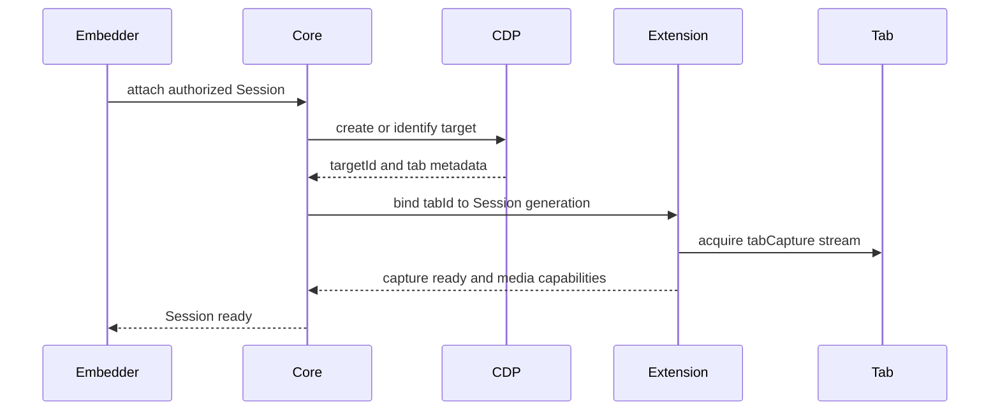

# Chrome extension and Core

## Supported runtime

The production runtime is Google Chrome Stable. The official compatibility set pins an exact Chrome build and signed Extension version. Chrome for Testing may be used for development probes but is not the production runtime contract.

Google Chrome Stable no longer accepts ordinary unpacked-extension loading in the intended production path. The official deployment therefore uses a signed CRX, stable extension ID, Chrome Managed Policy, and the tested allowlisted-extension startup capability.

Unattended `chrome.tabCapture.getMediaStreamId()` requires Chrome to start with the installed
Extension ID explicitly allowlisted:

```text
--allowlisted-extension-id=<extension-id>
```

Without it, Chrome requires a per-tab user gesture and the Worker capability check fails. Remote
Tab documents and diagnoses this requirement; Chrome startup remains the Embedder or Worker's
responsibility.

## Extension packaging

- The official signing private key is stored only in release CI secrets.
- The signed CRX, update manifest, public extension ID and checksums are release artifacts.
- The update endpoint may be served by the runtime host on loopback.
- The official Extension does not self-update independently of a tested release.
- Third parties can use the official CRX or generate their own key, CRX, policy, ID and startup configuration with repository tools.
- Private keys, Profile data and local policies containing secrets never enter Git.

## Loopback relationship

Extension connects only to authenticated Core on loopback. Core and every managed Chrome process
share the current `runtimeGeneration` and secret. Each Chrome process additionally creates one
`runtimeInstanceId` in `chrome.storage.session`; its service worker and offscreen media document use
the same ID, service-worker restarts preserve it, and a Chrome restart creates a new ID. An older
Extension without this optional field remains compatible as one legacy runtime identified by
`runtimeGeneration`.

The page cannot access this channel. Extension validates every Core request against current runtime and Session state; a stale Core connection loses control when the runtime generation changes.

One `ExtensionLoopbackServer` may host multiple Chrome runtime pairs. A newly connected role replaces
only the same role for the same `runtimeInstanceId`; it never replaces another Chrome process. Core
broadcasts an unresolved CDP `targetId` to every connected service-worker runtime and accepts the
mapping only when exactly one runtime resolves it. Zero matches, multiple matches, mismatched
responses, and timeouts fail closed. Successful attachment establishes `Session → runtimeInstanceId`
before signaling begins; all later
media signaling, binary control, file acknowledgements, and lifecycle commands follow that mapping.
Disconnecting one runtime rejects only its pending operations and leaves other Chrome runtimes
available. Final Session cleanup releases the Session and Target mappings.

## Tab binding



Core correlates CDP target information with Extension tab metadata through trusted browser observations, not values supplied by the Viewer. If the mapping is ambiguous, attachment fails rather than selecting an arbitrary tab.

One tab belongs to at most one active Remote Tab Session. A Session may not switch to a different tab without a new attachment lifecycle.

## Capture

Extension owns `RTCPeerConnection` and the tab video/audio tracks. It applies requested constraints within Embedder-provided caps and verified browser support, then reports actual settings.

- Capture is per tab, not per browser window or desktop.
- Pausing stops RTP transmission while without stopping page execution.
- Resuming requests a keyframe and preserves DataChannels when possible.
- Audio is optional and controlled by Embedder capability.
- A capture ending unexpectedly fails that Session explicitly.

## CDP control

Core uses CDP for deterministic browser actions:

- Pointer, wheel, keyboard and text insertion.
- Viewport emulation and coordinate acknowledgement.
- Top-level navigation, history and reload.
- File input selection.
- Target creation, discovery and close.
- Title, location and lifecycle observation.

CDP binds only to loopback or private IPC. Its WebSocket URL never enters Viewer messages, browser storage, logs or error details.

## New targets

The default `close-and-local-open` policy installs an internal MAIN-world `window.open` wrapper with
`Runtime.addBinding` and `Page.addScriptToEvaluateOnNewDocument`. Calls targeting a new browsing
context report their resolved URL to Core without creating a remote target. Calls targeting `_self`,
`_parent`, or `_top` retain native behavior. The wrapper is applied to existing and future documents
and returns `null`; this deliberate compatibility boundary must be tested for sites that inspect the
returned `WindowProxy`.

Chrome can still create child targets through declarative links or browser behavior outside that
function. Core correlates `Page.windowOpen`, `Target.targetCreated`, and `openerId`; an attributed
normal-Session child is closed on the same serialized control chain before the URL enters the local
open flow. Serialization prevents target cleanup from competing with the input command that caused
it. An ambiguous target is never assigned to a user Session.

`retain` is the trusted maintenance policy. It does not install the `window.open` wrapper and keeps
reliably attributed child targets as part of the remote administrative interaction. Session cleanup
still closes those targets.

Remote Tab does not turn child targets into hidden extra Sessions.

## Files and downloads

Core uses an Embedder-provided Session storage adapter. Uploads are written outside the Chrome
Profile and injected with `DOM.setFileInputFiles`. Temporary upload files are removed with the
Session after delivery, cancellation, expiry, or failure.

Downloads use a separate absolute browser spool outside every Chrome Profile. When Core connects to
Chrome it configures `Browser.setDownloadBehavior` with `allowAndName`, so Chrome stores each file by
its opaque download GUID. Ownership does not come from `chrome.downloads.DownloadItem`: that API has
no reliable source `tabId`. Instead, the flattened CDP Session for the owning page receives
`Page.downloadWillBegin`; Core records that GUID only in that Remote Tab Session and waits for its
matching `Page.downloadProgress` completion.

After completion Core stats the GUID file, applies Session limits, normalizes the suggested filename,
and offers it to the active Viewer. An accepted file is sent in acknowledged 64 KiB chunks over the
file DataChannel. Viewer completion is acknowledged back to Core before the spool file is removed.
Rejection, timeout, capability revocation, Viewer replacement, Session close, and transfer failure
also remove the GUID file. A GUID unknown to the Session is never opened or delivered.

Extension only transports the Session-bound offer, chunks, acknowledgements, and result through its
authenticated loopback and file DataChannel. It does not observe browser-global download metadata,
read the spool, or decide which Session owns a file.

Native operating-system file dialogs are never exposed to the user.

## Clipboard

Core exposes Session-scoped text and PNG clipboard operations through the same authenticated
Extension bridge and `file-transfer` DataChannel as file payloads. The Extension only forwards
validated envelopes and applies DataChannel backpressure; it does not read the host clipboard,
persist clipboard content, or choose which Session receives it.

Google Chrome exposes one runtime/host clipboard to every tab. `RemoteTabCore` therefore serializes
all clipboard reads and writes across its Sessions, not merely within one Session. Each operation
still carries the owning Session ID, Viewer generation and transfer ID, and its result is returned
only to that Session. This prevents concurrent operations from overwriting the shared clipboard
between the write and paste or read steps.

Before using the page Clipboard API, Core:

1. calls `Page.bringToFront`, because Google Chrome rejects clipboard access from a document that is
   not focused;
2. verifies a non-opaque secure origin and the presence of `navigator.clipboard`;
3. temporarily grants the origin's `clipboard-read` or `clipboard-write` permission with
   `Browser.setPermission`;
4. evaluates the operation with `userGesture: true`; and
5. restores that permission to `prompt` in a `finally` block.

`Page.bringToFront` briefly activates the owning tab and is an observable runtime side effect. It
does not change Session ownership. Clipboard access fails explicitly on an insecure or opaque
origin, when the API is unavailable, or when Google Chrome returns a Runtime exception. Runtime
exception details are reduced to an actionable error message; clipboard values are never logged.

The default limits are one `text/plain` item plus one `image/png` item, 16 MiB per item, 24 MiB in
total, 64 KiB chunks, and 120 seconds of inactivity. The Viewer, rather than Core or Extension,
owns the explicit local click and browser permission fallback UI.

## Page lifecycle events

Core injects one Embedder-provided Page Script into the top-level page MAIN world, then installs a
fixed bootstrap and dispatches lifecycle events after the script has had an opportunity to register
listeners:

```text
browshare:on_document_start
browshare:on_dom_content_loaded
browshare:on_load
browshare:on_location_changed
browshare:on_session_attached
browshare:on_session_detached
```

Each event is dispatched independently on `document` and `window`, does not bubble, and carries a
frozen detail object with `sessionId`, `occurredAt`, optional `location`, and optional Embedder JSON
`context`. Initial document events are ordered as document start, Session attached, initial location,
DOMContentLoaded, and load. History API changes, `popstate`, `hashchange`, and BFCache restoration
emit location changes only when the top-level URL actually changes. Full navigation receives a new
script and bootstrap; it does not emit Session detached. Core explicitly emits Session detached once
during final Session close before the CDP target is torn down.

The Extension does not inject, store, or interpret administrator JavaScript; it only transports the
validated `page.lifecycle` message over the existing reliable channel. Headless Client exposes a
typed `page-script-event`, and Viewer forwards it to the host without default UI.

Remote Tab provides the execution and event plumbing only. The Embedder owns script source, versions,
applicability and authorization. Source is limited to 512 KiB and JSON context to 64 KiB. Syntax and
runtime errors are reduced to `page-script.error` diagnostics, while the bootstrap and Session remain
available. Script errors cannot expand capabilities or bypass navigation decisions.

## CDP ownership loss

Every attached Session owns a browser-level CDP WebSocket and one flattened target attachment.
Connection close, main-target destruction or crash, `Target.detachedFromTarget`, and
`Inspector.detached` are terminal ownership-loss signals. The controller normalizes the first signal
to one `tab-unavailable` event; later close signals are ignored. Session transitions immediately to
`FAILED`, stops media and signaling, cancels transfers, removes temporary files, and releases its
Core/Standalone record. An active Viewer receives a best-effort stable error before teardown when
its reliable channel is still available.

Intentional Session close unsubscribes the ownership-loss observer before detaching and closing the
target, so its own cleanup cannot be misclassified as a crash. Remote Tab never restarts Chrome or
silently adopts another target. When Chrome returns and capability diagnostics are ready, the
Embedder creates a new Session explicitly.

## Cleanup

Closing a Session performs:

1. Invalidate Viewer generation and reject new input.
2. Stop media tracks and close PeerConnection/DataChannels.
3. Cancel or finish transfer cleanup.
4. Detach CDP domains and listeners.
5. Close the assigned main tab and normal-session child targets.
6. Remove Session temporary files.
7. Report final result to Embedder.

Cleanup is scoped to one Session. It never terminates Chrome or another Session's tab.

## Capability diagnostics

The diagnostic tool checks Chrome version, extension policy, extension ID and version, CDP reachability, loopback binding, unattended `tabCapture`, PeerConnection, DataChannels and optional audio. It returns machine-readable codes plus operator guidance.

It may generate CRX/policy configuration, but it does not install Chrome or rewrite an Embedder's browser service automatically.

The 2026-09-04 clipboard compatibility run used Google Chrome Stable `152.0.7977.75` and signed
managed Extension `0.1.13`. Active service-worker and media roles both reported `0.1.13` with
`coherent: true`. The run established that Chrome 152 requires PermissionDescriptor names
`clipboard-read` and `clipboard-write`; the older aliases `clipboardReadWrite` and
`clipboardSanitizedWrite` are rejected.

The Page Script compatibility run used the same Google Chrome Stable version and signed managed
Extension `0.1.14`. It verified MAIN-world execution before all five initial document events,
document and window delivery, SPA and full-document navigation, Viewer forwarding, runtime and syntax
error isolation, and final `on_session_detached` delivery while Core was closing. Both active
Extension roles reported `0.1.14` and `coherent: true`.

A separate `0.1.14` runtime run closed one READY Session target and then killed the entire Chrome
process while another READY Session had no command in flight. Standalone evicted the records in 43
ms and 104 ms respectively, remained running, reported CDP unavailable while Chrome was down, and
returned to ready after the operator restarted Chrome. The same Session ID could then be created
again and explicitly cleaned.

## Fresh managed installation

Chrome can start the service worker before the newly installed extension schema has made its
managed policy values available. The worker subscribes to `chrome.storage.onChanged` at module
initialization and retries configuration loading when the required managed keys arrive. An event
received during an in-flight startup requests one retry only while configuration is still missing;
a successful startup consumes that request without replacing its loopback socket. Invalid
configuration remains an explicit startup failure. No default secret, runtime generation or
loopback address is substituted.

The `0.1.15` candidate was exercised with two empty Profile directories in the same Chrome Stable
Worker. Both completed force-install, authenticated service-worker/offscreen binding, unattended
capture and real publisher offer creation in their first Chrome process.


## Automatic encoder quality

The 0.1.23 candidate keeps Chrome's native congestion controller and adds a slower Publisher-owned
adjustment loop. `auto` begins with bounded balanced settings (2.5 Mbit/s, 30 FPS, scale 1); its
recovery ceiling is 6 Mbit/s, 60 FPS, scale 1, intersected with Core's Session limits. Preset/custom
modes do not run this application adjustment loop.

The existing five-second outbound RTCStats sampler runs while diagnostics or auto needs it.
Automatic control can sample without `diagnostics`; it does not enable diagnostic delivery. Only
samples with a measured interval between 1 and 15 seconds count. Low encoded FPS/bitrate alone is
normal on static pages and is never a pressure signal.

| Condition | Consecutive samples | Action |
| --- | ---: | --- |
| Sender `qualityLimitationReason` is `cpu`/`bandwidth`, loss ≥5%, or RTT ≥400 ms | 3 | Multiply bitrate by 0.7, FPS by 0.8, downscale factor by 1.25 |
| Limitation reason `none`, loss <1%, known RTT <200 ms | 6 | Divide by those factors, bounded by the auto ceiling |
| Invalid interval, suspension, capture replacement or disconnected peer | — | Clear pressure/recovery history |

Reduction uses integer bitrate/FPS, a bitrate floor of 250 kbit/s and FPS floor of 5 (or the smaller
Session ceiling), and a maximum downscale factor of 4. Recovery is deliberately slower than
reduction; at normal cadence the observation windows are roughly 15 and 30 seconds, rather than
an immediate reaction to one noisy sample. This is a policy controller, not a promised throughput
or visual-quality guarantee.

All sender changes, suspend/resume and capture replacement share the Publisher media-operation
queue. Initial `getUserMedia` acquisition uses `captureFrameRateLimit` from the Session ceiling
(or viewport FPS for a low-level caller that omits it). Chrome fixes a source limit at acquisition:
acquiring at 30 FPS prevents later `applyConstraints(60)` from delivering 60 FPS. Acquiring at the
Session ceiling allows later quality changes while initial encoding/capture constraints still apply
the current bounded FPS. The same rule applies to replacement sources. Applying quality updates both `RTCRtpSender` encoding parameters and the capture track's
frame-rate constraint: a sender-only 60 FPS request cannot raise an initially 30 FPS capture.
One `getParameters()` transaction snapshot is retained through `setParameters()`; capture updates
copy only mutable width/height/frameRate constraints, excluding the acquisition device token.
Chrome-reported sender values are checked before acknowledgement. Capture replacement reapplies
the current encoding settings and resets sampling history. Suspension retains the selected mode,
with adaptation paused until the peer resumes.

If application fails, restore the previous capture constraints and sender parameters only for
the stages that actually applied. A failed
rollback retires that Publisher. Manual failures carry their request ID; automatic failures retain
the last applied state after successful rollback, emit a bounded diagnostic and require a fresh
observation window before retrying. Stopping the Publisher closes its stats timer with its peer.

The implementation resides in `packages/extension/src/media-quality-policy.ts` and `offscreen.ts`;
the [focused development evidence](08-testing.md#advanced-quality-development-evidence-2026-09-06-unpublished-0123--protocol-14)
records real pressure/recovery results and the remaining candidate acceptance.
