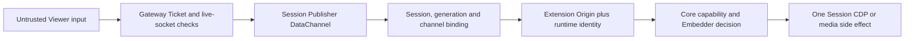

# Release-candidate security review

> [!IMPORTANT]
> The reviewed source and the clean deployment passed after five concrete findings were fixed. This
> does not make Remote Tab a security boundary between mutually untrusted users in one Chrome
> Profile, and it does not replace trusted TLS, host hardening or an independent penetration test.

## Decision

The current source is suitable to proceed from implementation candidate to first-release
preparation for the frozen Chrome `152.0.7977.75`, Extension `0.1.14` and control protocol `1.0`
compatibility set. The decision is based on source review, targeted regression tests and two
clean-environment deployment rehearsals. Actual npm, GHCR, source-tag and official CRX publication
remain separate deliverables.

The review covered the public Signaling Gateway, loopback Standalone API, Extension loopback,
Viewer-to-Publisher control boundary, Docker build context, runtime credentials, logs and cleanup.
The product boundary remains the one defined in [Scope and use cases](01-scope.md) and
[Security policy](../SECURITY.md).

## Trust path

Every step owns a different decision. A successful Ticket does not authorize arbitrary protocol
messages; a valid message does not select another Session; browser Origin does not replace the
runtime secret; and Page Script customization does not replace Core authorization.

## Fixed findings

| Finding | Risk | Resolution |
| --- | --- | --- |
| Runtime configuration entered the Docker build context used by `COPY . .` | High | `.dockerignore` now excludes `deploy/compose/runtime.env` and generated `extension-release` output |
| Viewer control frames were not independently bound to their Publisher Session, generation and DataChannel class | High | Extension decodes and validates the complete binding before loopback forwarding; violations stop that Publisher |
| Async Ticket verification or ICE assignment could complete after a peer disconnected | Medium | Gateway rechecks live socket and current pair ownership after asynchronous work before consuming or completing state |
| Extension loopback lacked an exact browser-Origin admission rule and an all-connection ceiling | Medium | HTTP upgrade requires the configured Extension Origin; runtime identity remains a second layer; connections are bounded |
| Expired replay records could remain visible in an idle Gateway metric | Low | Metric snapshots prune expired records before reporting capacity |

The first two findings protect cross-Session and build-secret boundaries. The Gateway race fixes
protect single-use credential and pairing-state integrity. Origin and capacity checks are defense in
depth around a loopback endpoint that still requires the correct runtime secret, generation,
Extension ID and role.

## Negative runtime results

The second clean deployment ran 14 Standalone/Gateway negative cases after the final rebuild:

- Missing and incorrect Standalone Bearer credentials returned `401 API_UNAUTHORIZED`.
- Unsupported media type, malformed JSON, oversized body and malformed path encoding returned
  `415`, `400`, `413` and `400` with stable safe error codes.
- A real test Session reached `READY`, proving the negative harness exercised the actual Chrome and
  Extension runtime rather than only an isolated HTTP server.
- Tampered, expired and wrong-Gateway Viewer Tickets were rejected.
- A wrong Core binding token and malformed signaling JSON were rejected.
- The first use of a real Viewer Ticket reached `signal.ready`; replay returned
  `VIEWER_TICKET_REPLAYED`.

The loopback test separately proved one accepted and three rejected HTTP upgrades: the exact
configured Extension Origin received `101`, while a missing Origin, ordinary web Origin and another
Extension ID each received `401`. A short-lived real Viewer Ticket changed the capacity gauge from
`1` while valid to `0` after expiry.

## Independent deployment reproduction

The security reproduction used a source snapshot that excluded `.git`, installed dependencies,
`tmp`, build output, runtime configuration, prior CRX files and signing keys. It generated:

- A new Extension private key and Extension ID.
- Four independent runtime credentials.
- A fresh Chrome Profile, temporary-data volume and log volume.
- A separate Compose project and six non-default host ports.

The legacy Docker builder reported a 2.397 MB context after the ignore fix. The deployment built the
pinned Google Chrome Stable package after verifying its SHA-256 and exact Debian version. Runtime
diagnostics reported Chrome `152.0.7977.75`, coherent Extension `0.1.14` roles, protocol `1.0` and
zero active Sessions. A real create/delete cycle reached `READY` and returned tracked and attaching
Session counts to zero. Only the Signaling port listened publicly; Extension updates, metrics, CDP,
Extension loopback and Standalone remained on loopback.

After all fixes, the deployment was rebuilt and the negative suite, Origin suite and log audit were
rerun. A final Gateway restart returned both containers to healthy, Standalone to ready and all
Gateway connection, peer, pair and consumed-Ticket gauges to zero.

## Log and secret boundary

The audit read bounded Docker logs plus the Chrome and Standalone files in the private log volume.
It compared them to the actual API token, Ticket signing secret, Core binding token, Extension
runtime secret and any configured ICE credential without printing those values. It also searched
for Bearer headers, JWS-shaped Tickets, SDP headers and fingerprints, ICE credentials and candidates,
and credential-bearing TURN URLs. Every check returned zero matches.

Runtime logs may contain bounded Session lifecycle identifiers and redacted diagnostic fields. They
must continue to omit Tickets, credentials, page content, clipboard data, transferred file content,
SDP and ICE addresses. See [Deployment and diagnostics](07-deployment.md) and
[Operations metrics, alerts and runbook](16-operations-runbook.md).

## Release gate

Before assigning the coordinated package version:

1. Run `pnpm check` and the design linter from a clean workspace.
2. Rebuild and parse all Compose variants.
3. Produce and verify the local artifact/SBOM/checksum bundle.
4. Confirm the first hosted GitHub workflow and retained provenance bundle after an initial commit
   exists.
5. Publish only Chrome-free Signaling and Standalone images. Operators build Chrome-node locally.
6. Run the installation and compatibility check against the exact signed Extension release.

The source-level protocol and public API freeze is documented in
[Gate 0 and first public API freeze](15-gate-0-and-api-freeze.md). Artifact and provenance policy is
documented in [Supply-chain artifacts and provenance](20-supply-chain-artifacts.md).

## Residual limits

- The quick-start Gateway uses plain `ws:` for a controlled first-host test; production requires
  trusted `wss:` ingress.
- Remote Tab does not manage Chrome installation, operating-system policy, Profile authorization or
  proxy policy. Those remain operator or BrowShare Worker responsibilities.
- One ordinary untracked Chrome page may remain after startup. Reconciliation reports it but does
  not guess ownership or delete it.
- Tabs sharing a Profile share cookies and browser storage. The tested Session controls prevent one
  Publisher from naming another Session; they do not create separate browser security principals.
- Trusted Embedder Page Script runs in the page MAIN world and can affect page behavior. It must be
  governed by the embedding product and is never an authorization control.
- The ignored detailed evidence directory is
  `tmp/gate0/phase7-security-review/`. It contains only redacted results and reproduction scripts,
  not secrets, Profile data or protocol payload captures.

